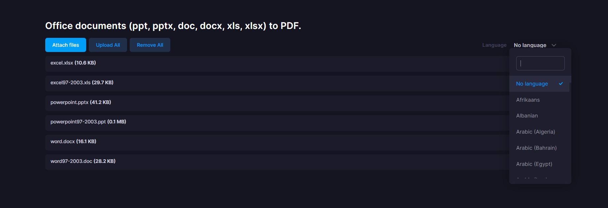

# Changelog
All notable changes to this project will be documented in this file.

## [1.0.4] - 2022/12/12
### Changed
- Added example of LibreOffice installation procedure to the Requirements section of README.md.

## [1.0.3] - 2022/12/12
### Changed
- Added language options to the web demo.  
    

## [1.0.2] - 2022/12/9
### Added
- Web demo added.
    Click [here](docs/web-demo/README.md) to learn how to use the web demo.

## [1.0.1] - 2022/11/10
### Fixed
- Fixed a typo in the README.

## [1.0.0] - 2022/11/10
### Added
- First release.

[1.0.1]: https://github.com/takuya-motoshima/msoffice2pdf/compare/v1.0.0...v1.0.1
[1.0.2]: https://github.com/takuya-motoshima/msoffice2pdf/compare/v1.0.1...v1.0.2
[1.0.3]: https://github.com/takuya-motoshima/msoffice2pdf/compare/v1.0.2...v1.0.3
[1.0.4]: https://github.com/takuya-motoshima/msoffice2pdf/compare/v1.0.3...v1.0.4