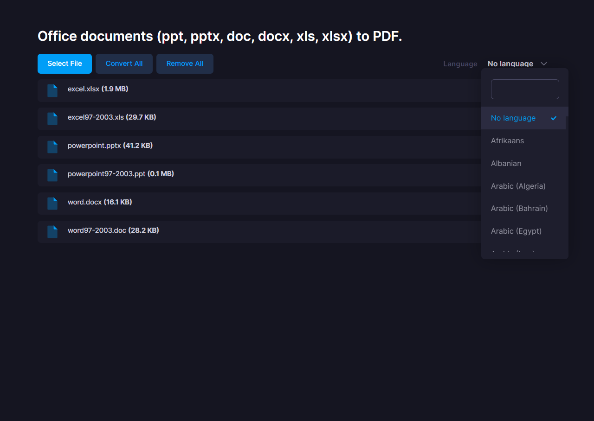

# Changelog
All notable changes to this project will be documented in this file.

## [1.0.13] - 2023/1/15
### Added
- Added evidence ([https://takuya-motoshima.github.io/msoffice2pdf/evidence/](https://takuya-motoshima.github.io/msoffice2pdf/evidence/)).

## [1.0.12] - 2023/1/10
### Added
- Added conversion result evidence from office documents to PDF.

## [1.0.11] - 2022/12/14
### Fixed
- Fixed typos in README.md.

## [1.0.10] - 2022/12/14
### Changed
- Move the web demo from &quot;docs/web-demo/&quot; to &quot;web-demo/&quot;.
- Fix to hide the upload progress when the conversion starts in the web demo.
- The conversion API error response has been changed to a simple error message instead of HTML.

## [1.0.9] - 2022/12/13
### Changed
- Added developer memo (DEVELOPER_NOTES.md).
- Added display of PDF conversion status to web demo.

## [1.0.8] - 2022/12/13
### Changed
- Changed some display text in the web demo.

## [1.0.7] - 2022/12/12
### Changed
- Added instructions for installing the latest LibreOffice to README.md.

## [1.0.6] - 2022/12/12
### Changed
- Add web demo dependencies (web-demo/node_modules/) to .npmignore.

## [1.0.5] - 2022/12/12
### Fixed
- Fixed a bug that caused the progress bar in the web demo to display incorrectly.
- The download and preview buttons are no longer displayed in case of upload errors in the web demo.

## [1.0.5] - 2022/12/12
### Fixed
- Fixed a bug that caused the progress bar in the web demo to display incorrectly.
- The download and preview buttons are no longer displayed in case of upload errors in the web demo.

## [1.0.4] - 2022/12/12
### Changed
- Added example of LibreOffice installation procedure to the Requirements section of README.md.

## [1.0.3] - 2022/12/12
### Changed
- Added language options to the web demo.  
    

## [1.0.2] - 2022/12/9
### Added
- Web demo added.
    Click [here](web-demo/README.md) to learn how to use the web demo.

## [1.0.1] - 2022/11/10
### Fixed
- Fixed a typo in the README.

## [1.0.0] - 2022/11/10
### Added
- First release.

[1.0.1]: https://github.com/takuya-motoshima/msoffice2pdf/compare/v1.0.0...v1.0.1
[1.0.2]: https://github.com/takuya-motoshima/msoffice2pdf/compare/v1.0.1...v1.0.2
[1.0.3]: https://github.com/takuya-motoshima/msoffice2pdf/compare/v1.0.2...v1.0.3
[1.0.4]: https://github.com/takuya-motoshima/msoffice2pdf/compare/v1.0.3...v1.0.4
[1.0.5]: https://github.com/takuya-motoshima/msoffice2pdf/compare/v1.0.4...v1.0.5
[1.0.6]: https://github.com/takuya-motoshima/msoffice2pdf/compare/v1.0.5...v1.0.6
[1.0.7]: https://github.com/takuya-motoshima/msoffice2pdf/compare/v1.0.6...v1.0.7
[1.0.8]: https://github.com/takuya-motoshima/msoffice2pdf/compare/v1.0.7...v1.0.8
[1.0.9]: https://github.com/takuya-motoshima/msoffice2pdf/compare/v1.0.8...v1.0.9
[1.0.10]: https://github.com/takuya-motoshima/msoffice2pdf/compare/v1.0.9...v1.0.10
[1.0.11]: https://github.com/takuya-motoshima/msoffice2pdf/compare/v1.0.10...v1.0.11
[1.0.12]: https://github.com/takuya-motoshima/msoffice2pdf/compare/v1.0.11...v1.0.12
[1.0.13]: https://github.com/takuya-motoshima/msoffice2pdf/compare/v1.0.12...v1.0.13