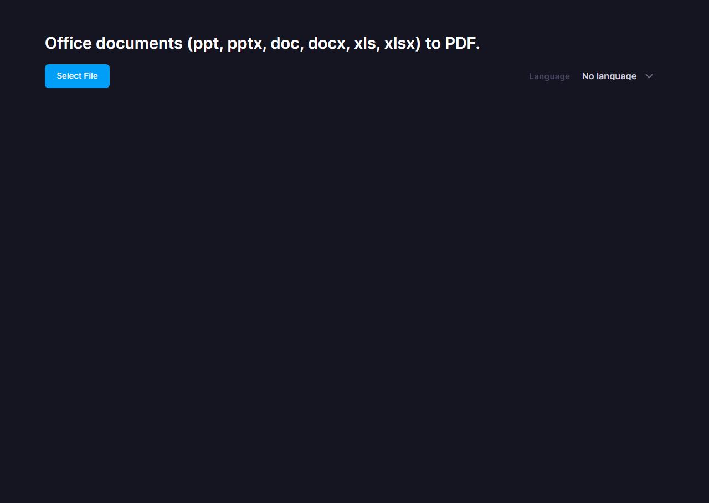
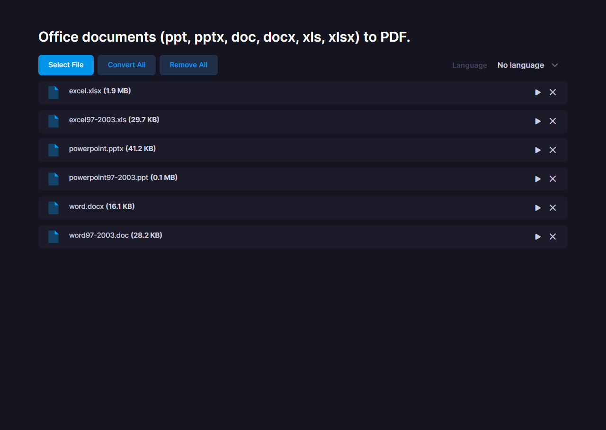
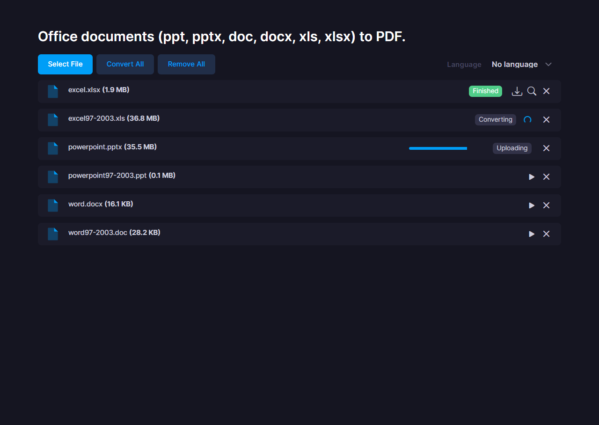
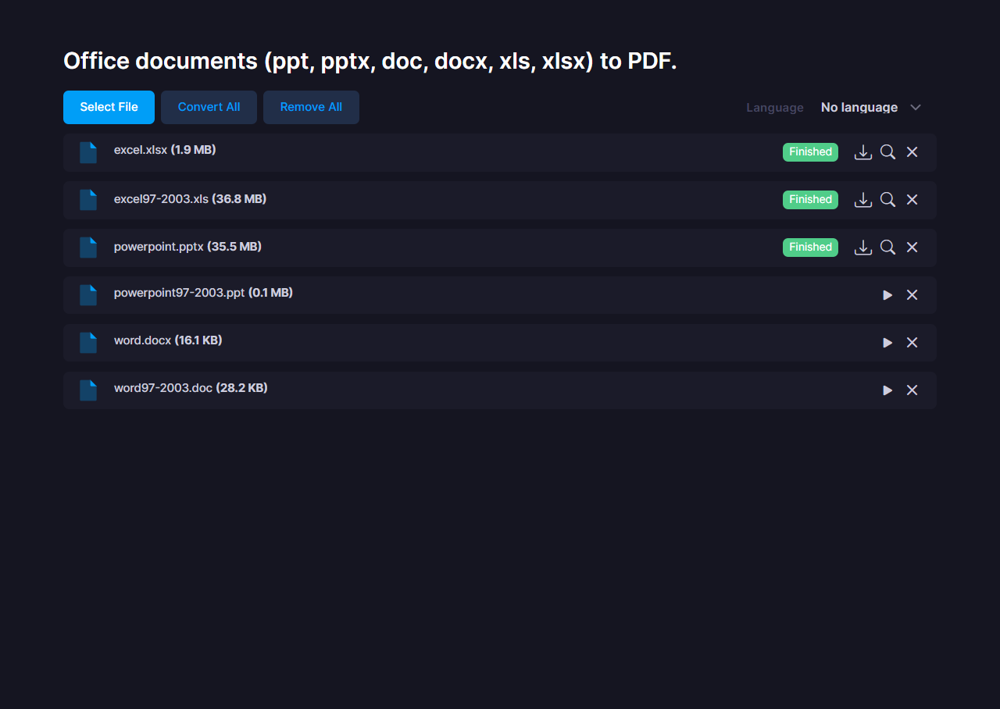

# Web demo of msoffice2pdf

## Getting Started
1. Install dependencies.
    ```sh
    npm install
    ```
1. Start the server.
    ```sh
    npm start
    ```
1. Open http://localhost:8080/ in your browser.  
    

## Usage
1. Click the &quot;Select File&quot; button to select the office documents you wish to convert to PDF.  
    
1. &quot;Convert All&quot; button to convert all files, or &quot;&quot; button to convert only selected files to PDF.  
    
1. When the conversion to PDF is complete, you can click the &quot;&quot; button to download the PDF and the &quot;&quot; button to preview the PDF.  
    
